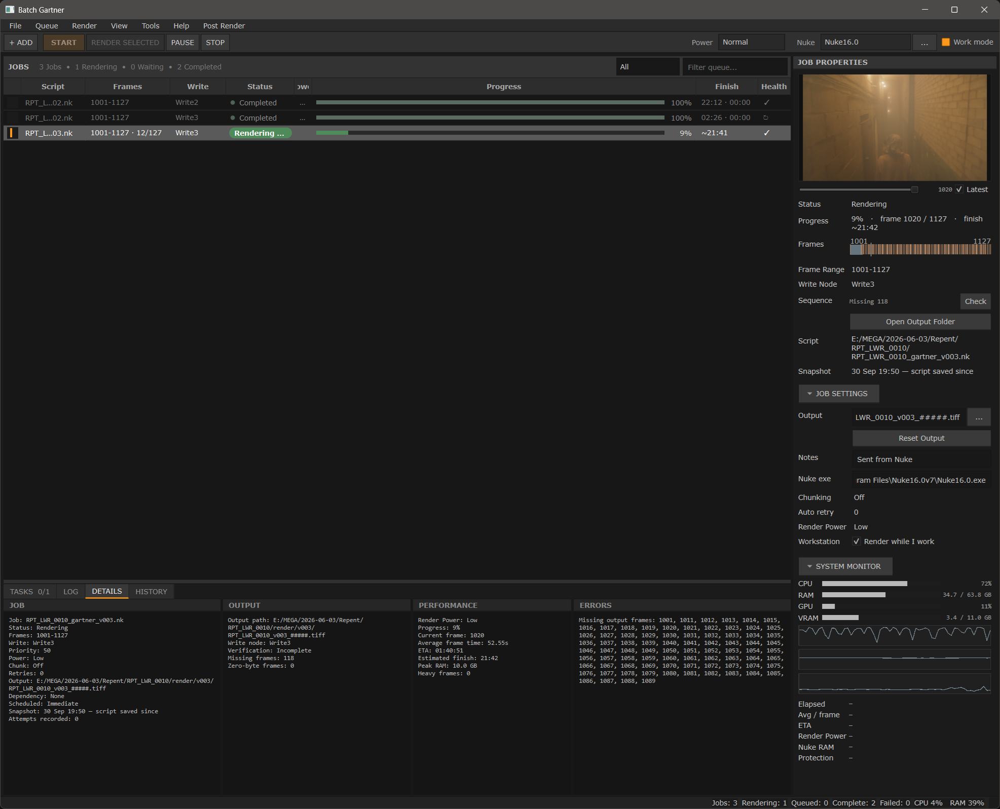

# Batch Gartner

**A local render queue manager for Foundry Nuke.**

Queue Nuke scripts, send Write nodes straight from Nuke, and render them one after another (or several at once) on your own workstation, with automatic resume, crash recovery and a live frame preview. No render farm needed.


<!-- Add a screenshot at docs/screenshot.png -->

---

## Why

Rendering from the Nuke GUI blocks your session, and queuing several comps overnight by hand is fragile. Batch Gartner renders in the background with Nuke's command line, so you can keep working. It keeps track of every frame and deals with the usual problems:

- You keep editing a script while it waits in the queue → it renders **the version you queued** (script snapshots).
- A render crashes or you stop it halfway → it **resumes from the frames already on disk**.
- An output file is briefly locked (a viewer, a cloud-sync app) → the frame is **retried** instead of failing the whole job.
- You re-render into a folder that already has frames → it **asks before overwriting**.

---

## Features

### Queue
- Add `.nk` scripts with **+ ADD**, drag & drop, a whole folder, or **straight from Nuke**
- One job per Write node, with priority, dependencies ("render after job X"), scheduled start and chunking
- Move jobs up and down (`Ctrl+Up` / `Ctrl+Down`), suspend, lock, duplicate, multi-edit
- **Lock** protects approved renders from edits, removal and re-rendering
- Undo for queue edits, and you can save and load queues

### Rendering
- Renders with Nuke's command line (`nuke -i -x` / `-t`), so the GUI stays free
- **Script snapshots**: every job renders the script as it was when queued. If you saved changes since, START asks whether to use the queued or the latest version.
- **Automatic resume**: failed or stopped jobs render only the missing frames
- **Overwrite protection**: *Render Missing Only / Overwrite All / Cancel*
- Half-written frames are deleted after STOP, skip or timeout
- **Test frame** and **First / Middle / Last** renders, plus **Render Missing Frames**
- Per-frame retry for locked files, per-task retries and timeouts
- **Render Power** (process priority) and **Render While I Work** mode
- Resource protection: waits for free RAM or CPU before starting a job, up to a maximum wait you set
- **Simultaneous renders** (optional, for big machines): up to 4 Nuke processes at once, each with an equal share of threads (`-m`) and cache (`-c`)
- **Pause after current job**, Skip, Stop, and shutdown or sleep when the queue finishes (only after a queue that really completed)

### Monitoring
- Live progress, current frame, ETA and finish time, and render duration
- **Built-in preview** of finished frames with a scrub slider (EXR, TIFF, PNG, JPG…). It never locks a file Nuke is writing.
- Sequence check for missing and zero-byte frames
- System monitor: CPU, RAM, GPU/VRAM (NVIDIA), and the Nuke process's memory
- Tasks, Log, Details (job, output, performance, errors) and History tabs
- Clear error types (Write error / file locked, missing file, out of memory, license…)
- Desktop notifications

### Nuke integration
- **Nuke › Batch Gartner** menu:
  - *Send Selected Write(s)* (`Ctrl+Alt+B`)
  - *Send All Writes*
  - *Send Selected Write(s) – Current Frame*
  - *Open Batch Gartner*
- Starts Batch Gartner automatically if it isn't running, without freezing Nuke
- **Create Read in Nuke**: right-click a finished job to drop a Read node for the render next to its Write node, in the Nuke session that has that script open

### Reliability
- Crash recovery: restores the real render state after an unexpected quit
- Settings are saved atomically, and only one instance runs at a time
- Startup errors are shown in a window and written to a log file

---

## Requirements

| | |
|---|---|
| **Nuke** | Nuke / NukeX with command-line rendering (developed with Nuke 15.x) |
| **Python** | A separate Python **3.9+** installation (not Nuke's own Python) |
| **PySide6** | `python -m pip install PySide6` |
| **psutil** *(recommended)* | CPU/RAM monitor, Render Power, resource protection: `python -m pip install psutil` |
| **OpenEXR + numpy** *(optional)* | EXR preview: `python -m pip install OpenEXR numpy` |

Developed and tested mainly on **Windows**. macOS and Linux are supported by the code (Nuke detection, file opening), but they are less tested.

---

## Installation

1. **Download or clone** this repository and keep the folder somewhere permanent.

   ```bash
   git clone https://github.com/<your-user>/batch-gartner.git
   ```

2. **Install the Python packages** with the Python you will use to run Batch Gartner:

   ```bash
   python -m pip install PySide6 psutil
   # optional, for EXR preview:
   python -m pip install OpenEXR numpy
   ```

3. **Install the Nuke menu** (run once, and again after every update):

   ```bash
   python install_batch_gartner_integration.py
   ```

   This copies `BatchGartner_NukeIntegration.py` into `~/.nuke`, adds the menu to `~/.nuke/menu.py`, and remembers where `BatchGartner.py` is.

4. **Restart Nuke.** You'll find the **Batch Gartner** menu in Nuke's menu bar.

5. **Run Batch Gartner**, from Nuke (*Batch Gartner › Open Batch Gartner*) or directly:

   ```bash
   python BatchGartner.py
   ```

6. In the toolbar, **pick your Nuke version** from the list, or click **`...`** (*Tools › Set Nuke Executable*) to browse for it.

> **Manual install:** if you'd rather not run the installer, copy `BatchGartner_NukeIntegration.py` into your `.nuke` folder (or anywhere on `NUKE_PATH`) and paste the contents of `menu_snippet.py` into your `menu.py`.

---

## Quick start

1. In Nuke, select one or more Write nodes and press **`Ctrl+Alt+B`**. The script is saved and the jobs appear in Batch Gartner.
2. Choose a **Render Power** in the dialog (Normal is fine).
3. Press **START**.
4. Watch progress in the queue and the **Preview**, and read Nuke's output in the **LOG** tab.
5. When the job finishes, right-click it › **Create Read in Nuke** to bring the render back into your comp.

### Useful workflows

| You want to… | Do this |
|---|---|
| Check a look before a long render | Right-click › **Render Test Frame…** or **More › Render First / Middle / Last** |
| Continue a stopped or failed render | Select it › **Retry** › **START** (only missing frames are rendered) |
| Render the latest save instead of the queued snapshot | Queue › **Refresh Script (use latest save)** |
| Fill gaps in a sequence | Right-click › **Render Missing Frames** |
| Protect an approved render | Right-click › **More › Lock / Unlock** |
| Render overnight and switch off the PC | **Post Render › Shutdown when queue finishes** |

---

## How it works

- **Rendering:** each job runs as a separate Nuke command-line process. With snapshots on (the default), a small helper script opens the snapshot inside Nuke and sets `root.name` back to the original script path. That way `[value root.name]` expressions, relative paths and versioned output names behave exactly as in the GUI.
- **Snapshots:** a copy of the `.nk` is taken when a job is queued. Unused snapshots are cleaned up automatically at startup.
- **Nuke → Batch Gartner:** the Nuke menu sends jobs over a localhost socket (default port **54321**).
- **Batch Gartner → Nuke:** each open Nuke GUI listens on the next free port (54322–54331) for *Create Read in Nuke*. It only runs in the GUI, never inside render processes.

All network traffic is local only (`127.0.0.1`).

---

## Preferences

*Tools › Preferences*

| Section | Settings |
|---|---|
| **Appearance** | Font, size, row height, status colours |
| **Queue** | Restore queue on launch, confirm removal, newer-version warning, default chunk size and retries |
| **Rendering** | Default Render Power, Render While I Work, script snapshots, auto-resume, overwrite confirmation |
| **Performance** | Monitor refresh, CPU/RAM protection, max wait for resources, **simultaneous renders** |
| **Notifications** | Desktop notifications on complete or fail |
| **Post Render** | Verify output, open output folder after queue |
| **Interface** | Remember window, panel and column layout |
| **Advanced** | Receiver port, recovery snapshots |

---

## Files and locations

| Path | What |
|---|---|
| `BatchGartner.py` | The application |
| `BatchGartner_NukeIntegration.py` | The Nuke menu (installed into `~/.nuke`) |
| `install_batch_gartner_integration.py` | Installer for the Nuke menu |
| `menu_snippet.py` | Manual alternative to the installer |
| `CHANGELOG.md` | Version history |
| `~/.nuke_batch_render_config.json` | Settings and queue |
| `~/.nuke_batch_render_logs/` | Render logs per script, plus `batch_gartner_errors.log` |
| `~/.nuke_batch_render_snapshots/` | Script snapshots |
| `~/.batch_gartner_recovery.json` | Crash-recovery snapshot |

On Windows `~` is `C:\Users\<you>`. Paste `%USERPROFILE%` into Explorer to get there.

---

## Troubleshooting

**Batch Gartner doesn't open.**
Run `python BatchGartner.py` from a terminal to see the error, or check `~/.nuke_batch_render_logs/batch_gartner_errors.log`. If it's already running (possibly hidden), starting it again brings the existing window to the front. Otherwise, end the leftover `python.exe` in Task Manager.

**"Could not find an external Python installation with PySide6" (from Nuke).**
Install PySide6 into a normal Python (`python -m pip install PySide6`), or set the environment variable `BATCH_GARTNER_PYTHON` to that `python.exe`.

**A frame fails with "Cannot open".**
The output file is locked, usually by an image viewer showing the frame being written, or a sync app (MEGA, Dropbox, OneDrive). Batch Gartner retries the frame for about 18 s. Use the built-in preview instead of an external viewer while rendering.

**Create Read in Nuke says no Nuke was found.**
Run `install_batch_gartner_integration.py` again and restart Nuke.

**No EXR preview.**
Install `OpenEXR` and `numpy` into the Python that runs Batch Gartner.

**The queue waits with "Waiting (resources)".**
Free RAM or CPU is below the job's protection threshold. Lower it under *Render Power / Resources*, or set a shorter *Max wait* in Preferences.

---

## Known limitations

- The sequence check, resume and preview need a job with a **single Write node** and a plain output path. Paths built from TCL expressions (e.g. `[value root.name]`) are rendered correctly but can't be checked on disk.
- Snapshot renders go through Nuke's `-t` mode and render frame by frame.
- CPU % readings in the monitor are approximate.
- GPU monitoring requires NVIDIA (`nvidia-smi`).

---

## Author

Pedro Gartner
